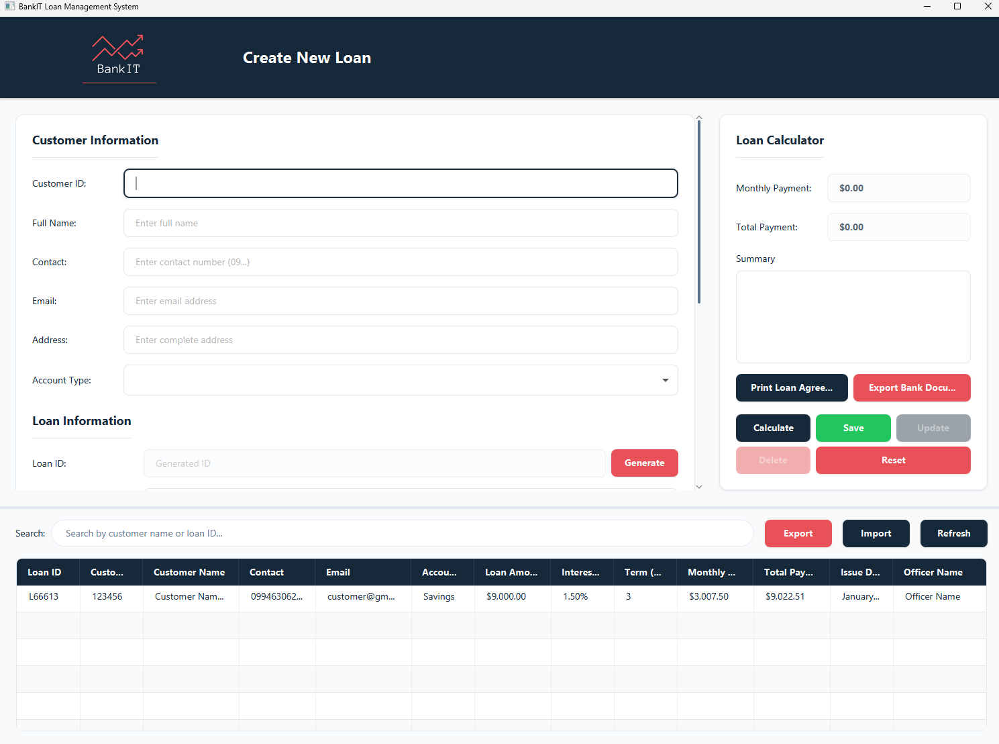
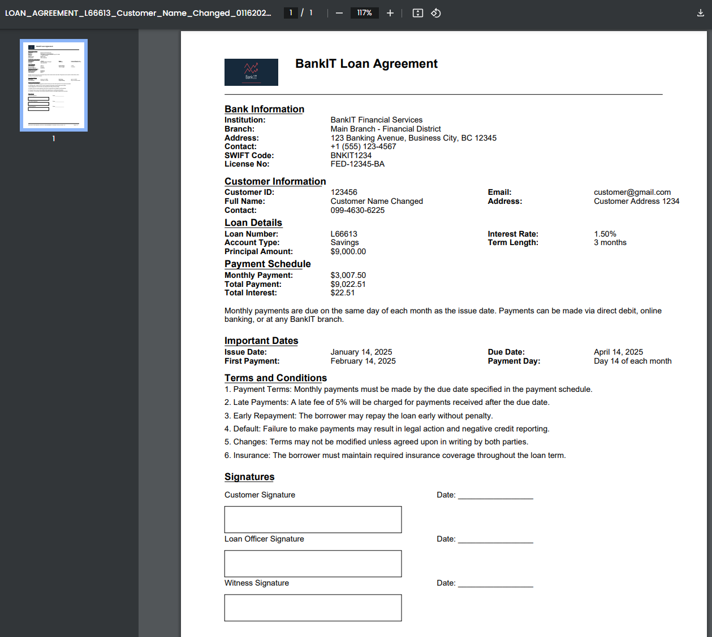
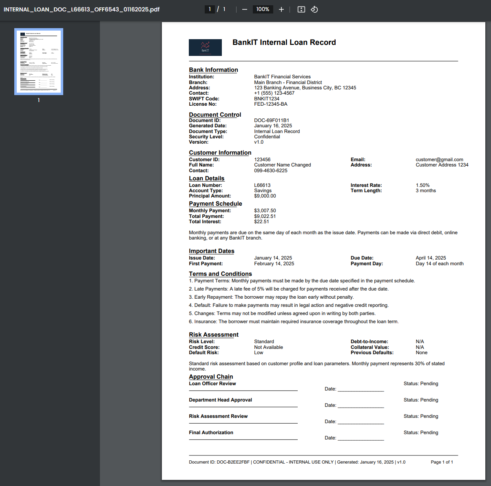
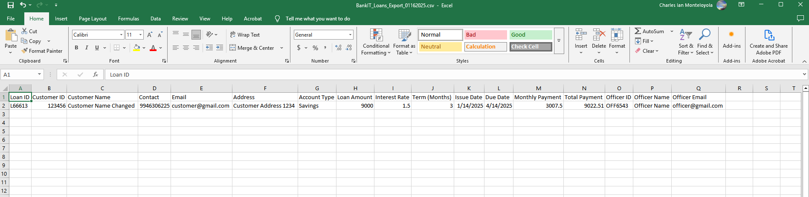

# BankIT Loan Management System

A robust Java-based desktop application for managing loan operations, built with JavaFX and SQLite. This system provides comprehensive loan management capabilities including loan creation, modification, document generation, and data export/import features.



## Features

### 1. Loan Management
- Create new loan applications with detailed customer information
- Edit existing loan records
- Auto-generate unique loan IDs
- Real-time loan calculation with monthly and total payment details
- Support for multiple account types (Savings, Checking, Joint)

### 2. Officer Management
- Assign loan officers to applications
- Create new officer profiles
- Automatic officer information retrieval

### 3. Document Generation
- Generate professional PDF loan agreements

- Export internal bank documents

- Standardized formatting and layout for all documents

### 4. Data Management
- SQLite database integration for persistent storage
- Export loan data to CSV format

- Import loan data from CSV files
- Data validation and error handling

### 5. User Interface
- Modern, intuitive JavaFX interface
- Real-time form validation
- Responsive table view with search functionality
- Dark mode support

## Technology Stack

- Java 18
- JavaFX 21.0.2
- SQLite 3.44.1
- PDFBox 2.0.27
- Maven
- CSS3
- Apache PDFBox

## Architecture & Design Patterns

### Architecture
- Model-View-Controller (MVC) pattern
- Data Access Object (DAO) pattern
- Service Layer pattern
- Factory pattern

```layered
Presentation Layer (JavaFX Views)
↓
Controller Layer (JavaFX Controllers)
↓
Service Layer (Business Logic)
↓
DAO Layer (Data Access)
↓
Database (SQLite)
```

### Project Structure
The project follows a modular architecture with clear separation of concerns:
```layered
src/
├── main/
│   ├── java/
│   │   └── com/bankit/loan/
│   │       ├── config/       # Configuration classes
│   │       ├── controller/   # JavaFX controllers
│   │       ├── dao/          # Data access layer
│   │       ├── model/        # Domain models
│   │       ├── service/      # Business logic
│   │       └── util/         # Utility classes
│   └── resources/
│       ├── css/             # Stylesheets
│       ├── db/              # Database files
│       ├── images/          # Application assets
│       └── view/fxml/       # JavaFX layouts
```

## Design Patterns

### Singleton Pattern
- ServiceFactory
- DAOFactory
- DatabaseConfig

### Factory Pattern
- Service creation
- DAO creation

### Builder Pattern
- Document generation
- PDF creation

### Observer Pattern
- UI updates
- Form validation

## Installation

### Prerequisites
- Java JDK 17 or higher
- Maven 3.8.x or higher
- Git

### Setup Steps
1. Clone the repository and switch to JavaFX branch
```bash
git clone https://github.com/CharlieBrown018/Loan-Management-System.git
cd Loan-Management-System
git checkout javaFX
```
2. Build the project
```bash
mvn clean install
```
3. Run the application
```bash
mvn javafx:run
```

## Usage Guide
1. Creating a New Loan:
  1. Fill in Customer Information fields
  2. Generate a Loan ID
  3. Complete Loan Information
  4. Select or create Officer Information
  5. Click Calculate then Save
2. Editing Existing Loans:
  1. Select loan record from table
  2. Modify desired fields
  3. Click Update to save changes
3. Document Generation:
  1. Select loan record
  2. Click "Print Loan Agreement" for customer copy
  3. Click "Export Bank Document" for internal copy
4. Data Export/Import:
  1. Use Export button for CSV export
  2. Use Import button to load CSV data
  3. Use Refresh to update table view
